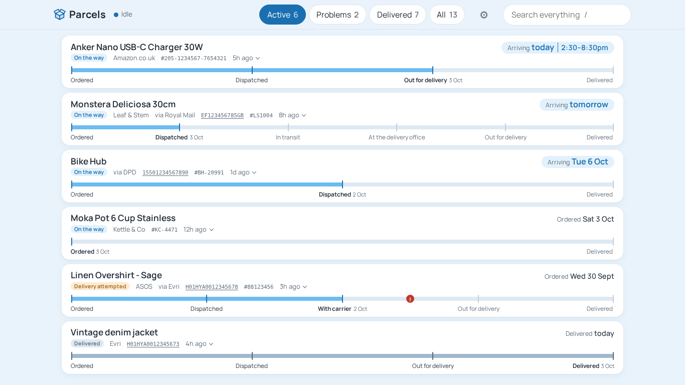
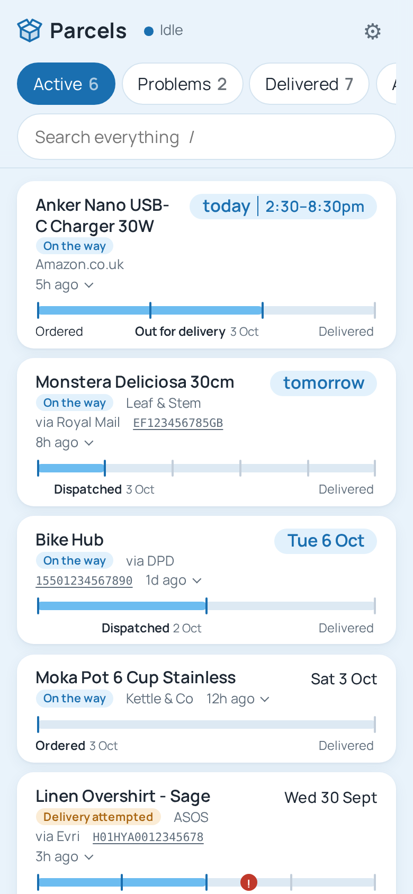
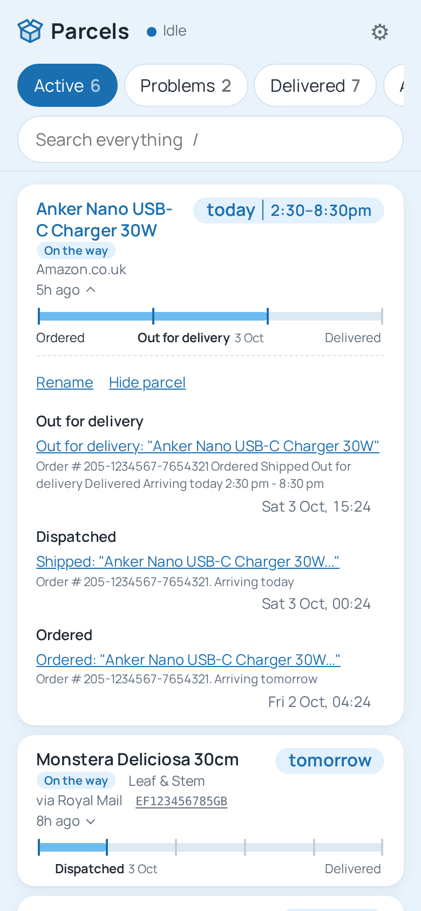
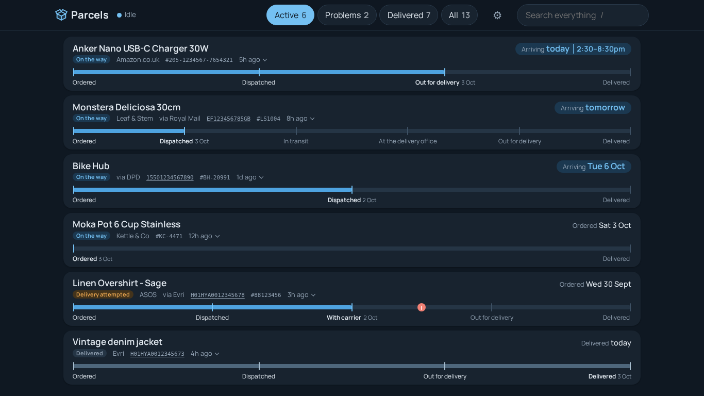
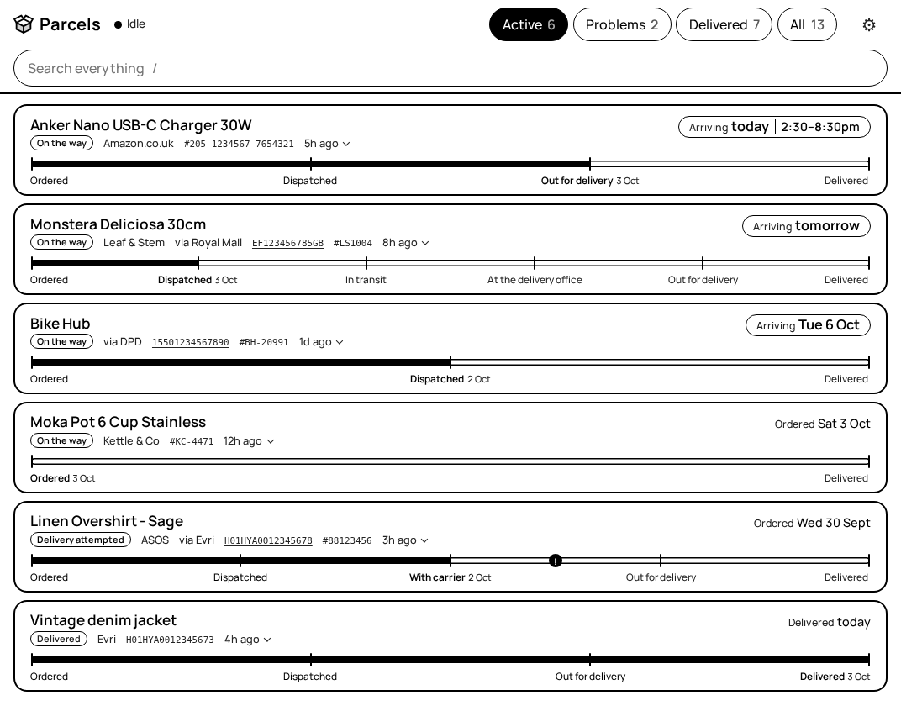
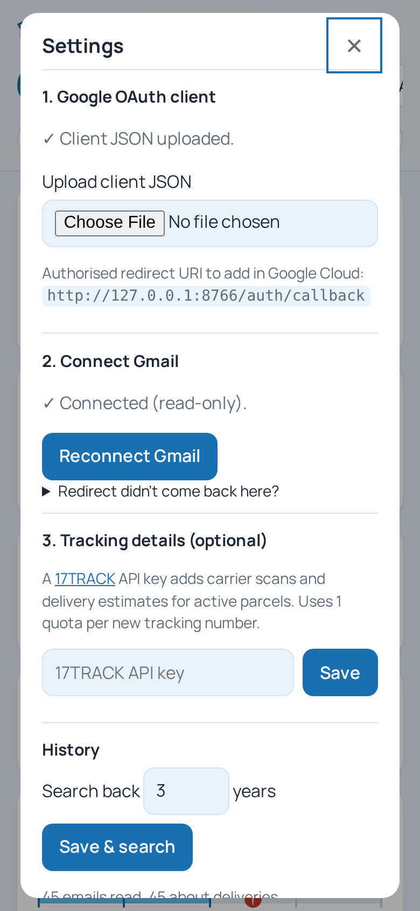

<p align="center">
  
</p>

<h1 align="center">Parcels</h1>

<p align="center">
  Every parcel you're waiting for, in one list, built from emails in your Gmail.<br>
  Self-hosted. No tracking, no browser extension, no third-party services needed.
</p>

<p align="center">
  
</p>

## What it does

Parcels reads your inbox (read-only) and finds the emails about orders and deliveries: confirmations from shops, then dispatch, out-for-delivery and delivered emails from couriers. It groups each set into a single parcel and shows how far along it is.

- **One timeline per parcel.** Shop emails and courier emails are joined by order number, tracking number or email thread. The steps fill in from left to right.
- **Learns each carrier's steps.** If Royal Mail always sends "at the delivery office" before "delivered", future Royal Mail parcels show that step ahead of time.
- **Arrival day and delivery slot.** "Arriving today 2:30–6:30pm", "tomorrow", "by 5pm". When a courier emails a new slot, the newest one wins.
- **Estimates when nobody says.** With no date from the shop or courier, the arrival day is worked out from the postage service ("Tracked 48" = two working days after dispatch), or else from how long that shop or courier usually takes, based on your past deliveries.
- **Problems stand out.** Missed deliveries, delays, returns, fees to pay and lost parcels get a flag on the timeline and appear under the Problems tab.
- **Search everything.** Item names, shops, couriers, tracking and order numbers, all searchable instantly. Press `/` to start.
- **Rename and hide.** Some parcels only come with a courier's email (a Vinted buy is just "Evri"), so you can give any parcel your own name, or hide it. Both survive re-parsing.
- **Live.** New mail is checked every 60 seconds, and open pages update without reloading.
- **Light, dark, match device, or e-ink.** E-ink mode is pure black and white with no animation, and redraws as little as possible, for a wall-mounted e-reader.
- **Works on a phone.** One column, large touch targets, and the page never scrolls sideways.

Supported out of the box: Amazon, Royal Mail, Evri, DPD, Yodel, InPost, UPS, and most shops on Shopify, WooCommerce or Magento. Anything else falls back to sensible defaults, and the steps improve as more of its emails arrive.

## Screenshots

<table>
  <tr>
    <td width="50%"></td>
    <td width="50%"></td>
  </tr>
  <tr>
    <td align="center">On a phone</td>
    <td align="center">Open a parcel to see every email about it</td>
  </tr>
</table>

<p align="center"><br>Dark theme</p>

<table>
  <tr>
    <td width="62%"></td>
    <td width="38%"></td>
  </tr>
  <tr>
    <td align="center">E-ink mode</td>
    <td align="center">Settings</td>
  </tr>
</table>

<sub>All screenshots use made-up emails, shops and tracking numbers.</sub>

## Quick start

You need Python 3.12+, [uv](https://docs.astral.sh/uv/), and a Google account.

```sh
git clone https://github.com/Tom1tk/Parcels.git
cd Parcels
./run.sh              # serves on http://0.0.0.0:8765
```

Then open the page. Settings opens on first visit, and walks you through uploading a Google OAuth client and connecting Gmail. **[SETUP.md](SETUP.md)** covers the Google Cloud side step by step (about 10 minutes), including how to stop the sign-in expiring every 7 days.

To run it as a service, edit the paths in [`parcelwatch.service`](parcelwatch.service), then:

```sh
sudo cp parcelwatch.service /etc/systemd/system/
sudo systemctl daemon-reload && sudo systemctl enable --now parcelwatch
```

Parcels has **no login of its own**. Keep it on your home network, or put it behind something that handles authentication (for example Cloudflare Tunnel with Access).

### Optional: 17TRACK

Add a [17TRACK](https://api.17track.net) API key in Settings, and active parcels also get carrier scan events and estimates. The free quota is small, so only parcels still on their way are registered. Everything else works without it.

## How it works

```
Gmail ──► gmail.py ──► parse.py ──► db.py (SQLite) ──► build.py ──► main.py ──► static/ (vanilla JS)
          read-only    facts per    one row per         group into    FastAPI +
          OAuth, 60s   email        email               parcels       live updates (SSE)
          poll
```

- **`app/parse.py`** turns one email into facts: stage (ordered, dispatched, out for delivery…), carrier, tracking and order numbers, item names, ETA and delivery slot. It's plain rules and regular expressions, with no AI and nothing sent anywhere.
- **`app/build.py`** rebuilds every parcel from the stored facts whenever something changes. Parser improvements therefore apply to old mail too: when `parse.py` changes, the next start re-reads the stored emails.
- **`app/main.py`** serves the API, a server-sent-events stream for live updates, and the background sync loop.
- **`static/`** is a single page with no build step and no framework. The font is [Manrope](https://github.com/davelab6/manrope), self-hosted.

Your data stays in `data/` (git-ignored): the SQLite database, the OAuth client and the token. Delete that folder to forget everything.

## Development

```sh
uv run pytest
```

The tests feed made-up emails, based on the real formats from each shop and courier, through the parser and the parcel builder. When a new email format gets misread, the fix comes with a test for it.

See [SPEC.md](SPEC.md) for the original requirements, and [PLAN.md](PLAN.md) for what's done and what's next.

## Credits

- [Manrope](https://github.com/davelab6/manrope) by Mikhail Sharanda, under the [SIL Open Font License](static/fonts/OFL.txt).
- Built with [FastAPI](https://fastapi.tiangolo.com), [uv](https://docs.astral.sh/uv/) and the [Gmail API](https://developers.google.com/workspace/gmail/api).

## Licence

[MIT](LICENSE). Manrope keeps its own licence (OFL, above).
